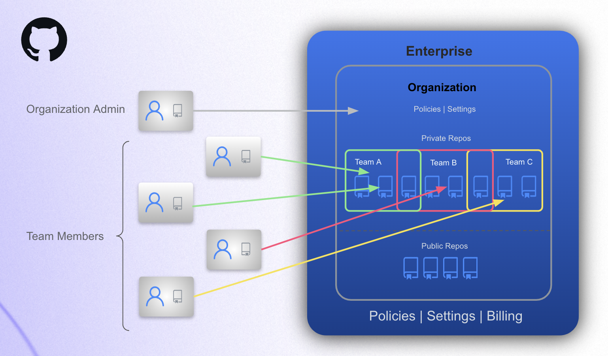

# Overview: What's in a GitHub Enterprise? 
An intro to the Enterprise account, Organizations, Repositories, Teams, and Classrooms

----

### Enterprise Account

An enterprise account provides a single point of visibility, management, and enforcement of policies and settings for your institutions's GitHub presence.

- 

  
Overview

   

  - An enterprise contains organizations.
  - Enerprise admins control high level policies & settings for their organizations.
  - Enterprise admins can manage paid features and set spending limits for their organizations.
  - People consume an enterprise license by virtue of their membership in an organization that belongs to the enterprise.

   

  - 

   
  

- 

  
What's in an Enterprise Account?

   
  
  - Organizations.
  - Policies & Settings
  - Security Insights (Dependabot & Advanced Security)
  - GitHub Connect (connects Server instances to Cloud instances for schools using GitHub Enterprise Server in addition to GitHub Enterprise Cloud).
  - Audit Log
  - Enterprise Admins
  - List of Non-Admin Enterprise Members (**Note:** all non-admin members are members via their membership in an organization.)
  - GitHub Compliance Reports
  
   
  

----

### Organizations

An organization is where a group of people, such as an IT team, department, class, or research group, collaborate on code.

- 

  
Overview

   

  - Each organization can have a distinct set of members.
  - Each organization has it's own repositories and teams.
  - Organizations can have a few to a few thousand repositories.
  - Organizations can have many teams.
  - Repository access within an organization is limited via individual user permissions or Teams.
  - Organizations can also have classrooms, where professors, TAs, and students interact.
 
   

  - 

   
  

- 

  
What's in an Organization?

   

  - Repositories
  - Classrooms
  - Copilot License Assignment
  - Projects
  - Packages
  - Discussions
  - Teams
  - Security Insights (Dependabot & Advanced Security)
  - Org Level Insights
  - Audit Log
  - Members
  - Policies & Settings
  - Repository Rulesets (org wide)

   
  

----

### Repositories

A repository is where people collaborate on code. 

- 

  
Overview

   

  - There are three types of repositories.
    - **Private** - only accessible to members of the org.
    - **Internal** - accessible to members of all orgs in an enterprise (used for [innersource](https://resources.github.com/innersource/what-is-innersource/)).
    - **Public** - can be read or forked by anyone on the internet.
  - Repositories can be filtered by things like type, language, and license.
  - Repositories can also be categorized with custom properties for easy filtering by property.
  - Repository access is managed via GitHub Teams (see below).
  - Rulesets control how users interact with repository branches and tags.

   
  

- 

  
What's in a Repository? (Code! but there's more 🙂)

   
  
  - Code
  - Pull Requests
  - Issues & Projects (project management)
  - Wikis
  - Actions (CI/CD)
  - GitHub Advanced Security Alerts
  - Repo Insights
  - Repository Rulesets
  - Codespaces

   
  

----

### Teams

A team is a group of organization members with role based access to organization settings and/or repositories.

- 

  
Overview

   

  - Teams are used to control repository and organization access permissions.
  - Teams are used for communication within GitHub (e.g., notifying a team that a particular PR needs attention).

   
  

- 

  
What's in a Team?

   

  - Members
  - Repository Access Controls
  - Project Access Controls (**Note:** Projects are used to organize work to be done by a team.)
  - Organization Role Controls

   
  

----

### Classrooms

A classroom is a place where teachers, TAs, and students interact on GitHub during a class.

- 

  
Overview

   

  - Organizations can have one or many Classrooms.
  - Classrooms are used to assign and grade student work.

   
  

- 

  
What's in a Classroom?

   
 
  - Roster of Students
  - Individual and/or Group Assignments
  - Assignment Deadlines
  - Template Repositories
  - Autograding via Automated Specs & Feedback
  - Connection to a Learning Management System (LMS)
 
   
  

----
